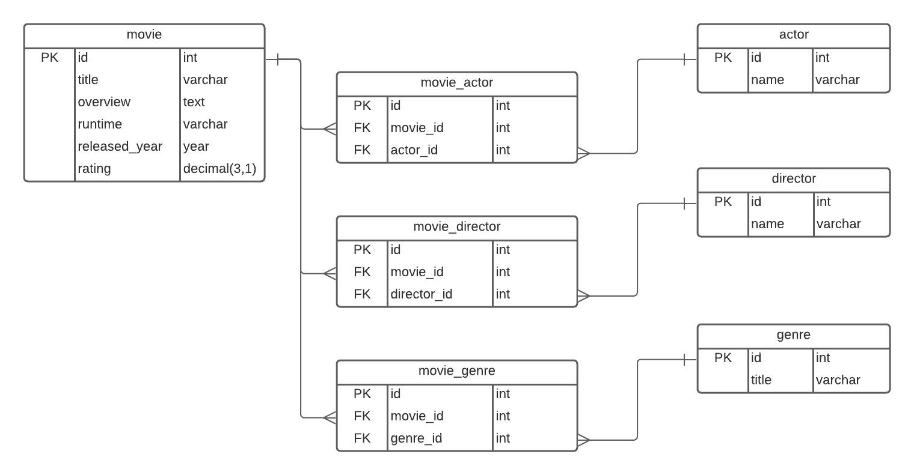

# Banco de dados - Exame
- Dataset utilizado: [IMDB Top 100](https://www.kaggle.com/harshitshankhdhar/imdb-dataset-of-top-1000-movies-and-tv-shows)
- O Dataset foi convertido de CSV para JSON e posteriormente modelado para popular as tabelas do banco

## Overview


## Configuração
- Baixando o projeto
```bash
$ git clone https://github.com/gabrielvictorjs/exam_db_1_imdb.git
$ cd exam_db_1_imdb
```

- Certifique-se que o mysql está sendo executado
- Crie um banco de dados executando `create table imdb;`

- Populando o banco usando **Python**

  1. Crie um arquivo `.env` na raíz do projeto baseando-se no arquivo `.env.example` e preencha os valores (HOST, USER, PASSWORD, PORT)
  
  2. Rode o comando ```$ python3 db_seeder.py``` no terminal (certifique-se que está na raíz do projeto)

> Obs: É necessário ter as libs mysql-connector-python e python-dotenv instaladas.

- Populando o banco usando arquivos de dump
  
  É possível popular cada tabela de forma individual utilizando os arquivos de cada entidade ou popular todo o banco com executando o arquivo `imdb_dump.sql`


## Queries
### Selecionar todos os gêneros que um diretor trabalhou
```sql
select genre.title as "Genre",
       count(genre.title) as "Count",
       director.name as "Director"
from movies_directors movie_director
inner join movies movie on movie_director.movie_id = movie.id
inner join movies_genres movie_genre on movie.id = movie_genre.movie_id
inner join genres genre on movie_genre.genre_id = genre.id
inner join directors director on movie_director.director_id = director.id
where director.name like 'Christopher Nolan'
group by genre.title
order by count(genre.title) desc;
```
|Genre    |Count|Director         |
|---------|-----|-----------------|
|Action   |5    |Christopher Nolan|
|Drama    |4    |Christopher Nolan|
|Adventure|4    |Christopher Nolan|
|Sci-Fi   |3    |Christopher Nolan|
|Mystery  |2    |Christopher Nolan|
|Crime    |1    |Christopher Nolan|
|Thriller |1    |Christopher Nolan|
|History  |1    |Christopher Nolan|
---
### Selecionar todos os atores que trabalharam em um filme de guerra entre 2000 e 2005
```sql
select genre.title as "Genre",
       actor.name as "Actor",
       movie.released_year as "Year"
from movies_genres movie_genre
inner join movies movie on movie_genre.movie_id = movie.id
inner join genres genre on movie_genre.genre_id = genre.id
inner join movies_actors movie_actor on movie_actor.movie_id = movie.id
inner join actors actor on movie_actor.actor_id = actor.id
where genre.title like 'War' and movie.released_year >= 2000 and movie.released_year <= 2005
order by movie.released_year;
```
|Genre    |Actor|Year             |
|---------|-----|-----------------|
|War      |Branko Djuric|2001     |
|War      |Rene Bitorajac|2001    |
|War      |Filip Sovagovic|2001   |
|War      |Georges Siatidis|2001  |
|War      |Tom Sizemore|2001      |
|War      |Josh Hartnett|2001     |
|War      |Ewan McGregor|2001     |
|War      |Eric Bana|2001         |
|War      |Joseph Fiennes|2001    |
|War      |Rachel Weisz|2001      |
|War      |Ed Harris|2001         |
|War      |Jude Law|2001          |
|War      |Hyeong-jin Kong|2004   |
|War      |Jang Dong-Gun|2004     |
|War      |Eun-ju Lee|2004        |
|War      |Won Bin|2004           |

---
### Top 10 atores que mais aparecem no top 1000 e seus melhores filmes
```sql
select actor.name as "Actor",
       count(min_rating_movie.title) as "Participations",
       min_rating_movie.title as "Best Movie",
       min_rating_movie.rating as "Rating"
from actors actor
inner join movies_actors movie_actor on actor.id = movie_actor.actor_id
inner join (
    select id, title, rating
    from movies
    group by id
    order by rating desc
    ) min_rating_movie on movie_actor.movie_id = min_rating_movie.id
group by actor.id
order by Participations desc
limit 10;
```
|Actor    |Participations|Best Movie       |Rating|
|---------|--------------|-----------------|------|
|Robert De Niro|17            |The Godfather: Part II|9.0   |
|Clint Eastwood|15            |Il buono, il brutto, il cattivo|8.8   |
|Tom Hanks|14            |Forrest Gump     |8.8   |
|Al Pacino|13            |The Godfather    |9.2   |
|Brad Pitt|12            |Fight Club       |8.8   |
|Matt Damon|11            |Saving Private Ryan|8.6   |
|Leonardo DiCaprio|11            |Inception        |8.8   |
|Christian Bale|11            |The Dark Knight  |9.0   |
|James Stewart|10            |It's a Wonderful Life|8.6   |
|Quentin Tarantino|9             |Pulp Fiction     |8.9   |

---
### Selecionar atores que trabalharam com um diretor para cada gênero
```sql
select group_concat(actor.name separator ', ') as "Actors",
       genre.title as "Genre",
       director.name as "Director"
from directors director
inner join movies_directors movie_director on director.id = movie_director.director_id
inner join movies movie on movie_director.movie_id = movie.id
inner join movies_genres movie_genre on movie.id = movie_genre.movie_id
inner join genres genre on movie_genre.genre_id = genre.id
inner join movies_actors movie_actor on movie.id = movie_actor.movie_id
inner join actors actor on movie_actor.actor_id = actor.id
where director.name like 'Ang Lee'
group by genre.title
order by genre.title;
```
|Actors   |Genre|Director         |
|---------|-----|-----------------|
|Yun-Fat Chow, Ziyi Zhang, Chen Chang, Michelle Yeoh|Action|Ang Lee          |
|Irrfan Khan, Suraj Sharma, Adil Hussain, Michelle Yeoh, Chen Chang, Tabu, Yun-Fat Chow, Ziyi Zhang|Adventure|Ang Lee          |
|Tabu, Irrfan Khan, Suraj Sharma, Adil Hussain, Michelle Williams, Randy Quaid, Heath Ledger, Jake Gyllenhaal, Kate Winslet, Tom Wilkinson, James Fleet, Emma Thompson|Drama|Ang Lee          |
|Tabu, Irrfan Khan, Suraj Sharma, Adil Hussain, Yun-Fat Chow, Chen Chang, Michelle Yeoh, Ziyi Zhang|Fantasy|Ang Lee          |
|Michelle Williams, Randy Quaid, Heath Ledger, Jake Gyllenhaal, Kate Winslet, Tom Wilkinson, James Fleet, Emma Thompson|Romance|Ang Lee          |

---
### Top 10 diretores com mais filmes no top 1000 e seu melhor filme
```sql
select count(movie.title) as "Movies Count",
       movie.title as "Best Movie",
       movie.rating as "Rating",
       director.name as "Director"
from directors director
inner join movies_directors movie_director on movie_director.director_id = director.id
inner join movies movie on movie_director.movie_id = movie.id
group by director.name
order by count(movie.title) desc
limit 10;
```
|Director |Appearances|Best Movie       |Rating|
|---------|-----------|-----------------|------|
|Alfred Hitchcock|14         |Psycho           |8.5   |
|Steven Spielberg|13         |Schindler's List |8.9   |
|Hayao Miyazaki|11         |Sen to Chihiro no kamikakushi|8.6   |
|Martin Scorsese|10         |Goodfellas       |8.7   |
|Akira Kurosawa|10         |Shichinin no samurai|8.6   |
|Stanley Kubrick|9          |The Shining      |8.4   |
|Woody Allen|9          |Annie Hall       |8.0   |
|Billy Wilder|9          |Witness for the Prosecution|8.4   |
|David Fincher|8          |Fight Club       |8.8   |
|Quentin Tarantino|8          |Pulp Fiction     |8.9   |
